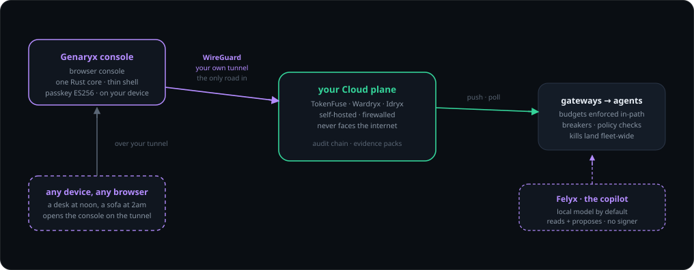
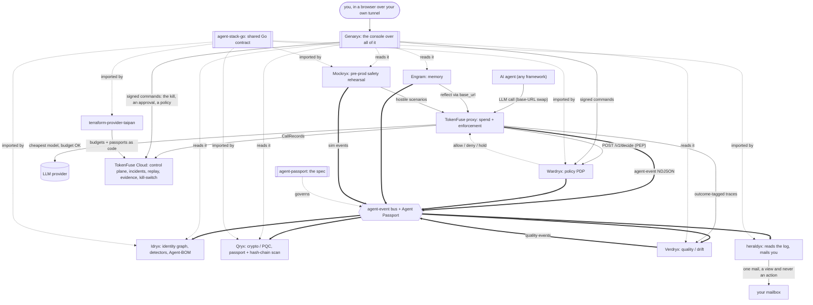
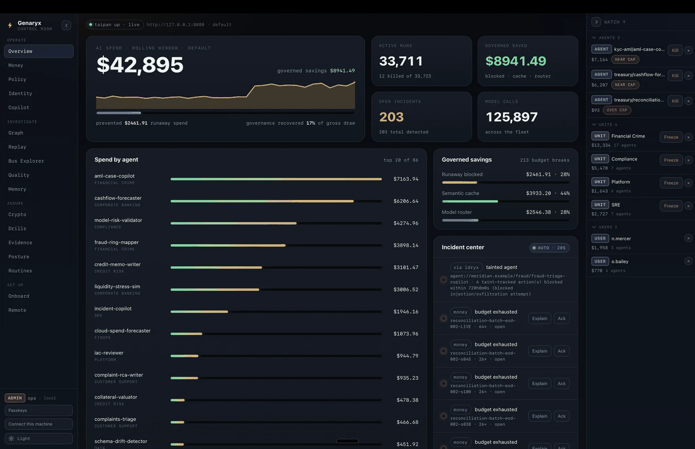
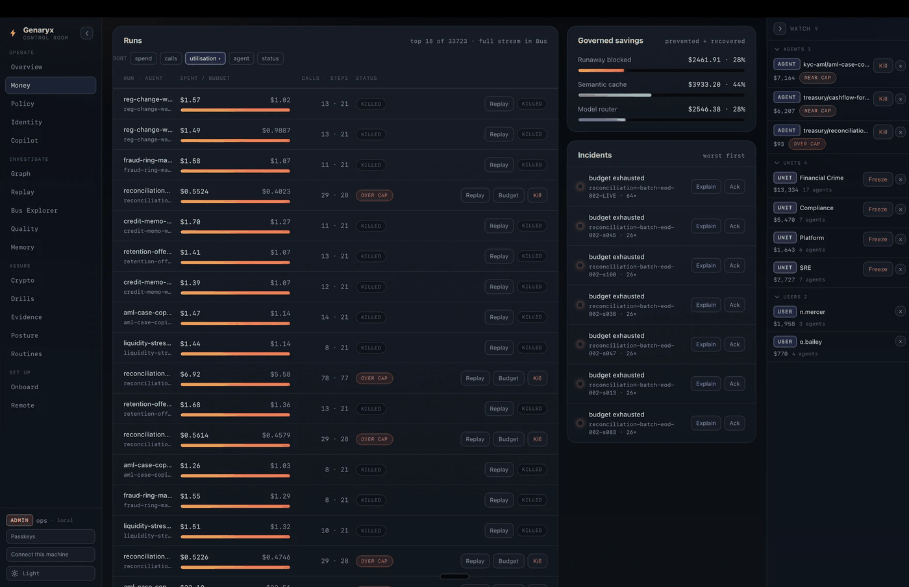
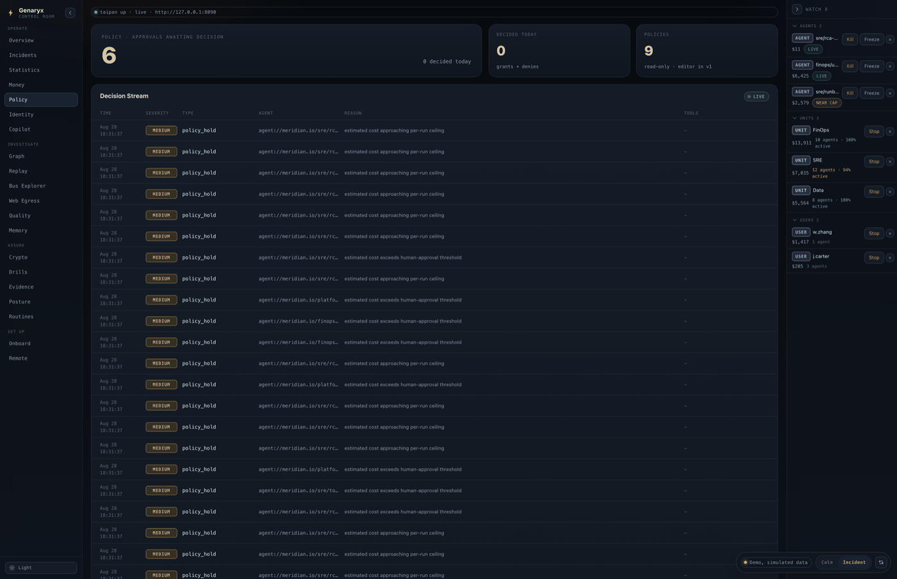
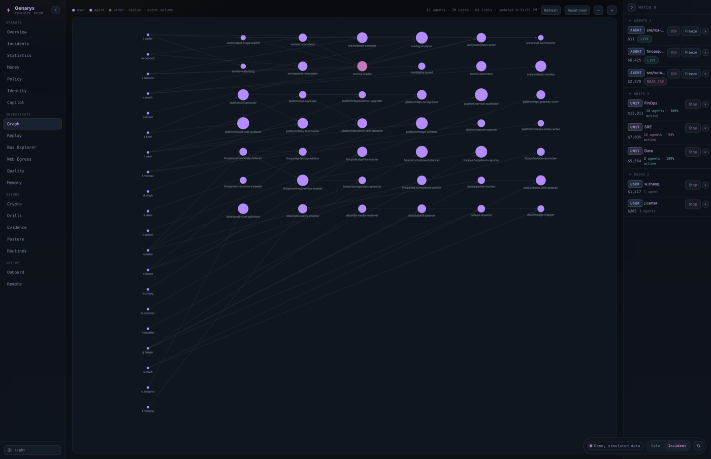

# Genaryx


The **control room** over the TAIPANBOX agent-governance stack: one window over
TokenFuse, Wardryx, Engram, Idryx, Qryx, Verdryx and Mockryx, running on your own
infrastructure and opened in a browser.

> **Apache-2.0**, like every other repository in the stack. See [LICENSE](LICENSE).

This repository was closed until **2026-07-27** and opened under Apache-2.0
with its history intact. A repository that changes licence owes the reader an
honest note rather than a badge, so here are the three things worth knowing
before you read further.

- **Parts of `docs/` are older than the licence.** Several design documents
  were written under the earlier model and still argue from it. They are left
  as they were written rather than quietly edited, because they record how the
  thing was built and when each decision was made. Read them as history; the
  code is the present tense.
- **The history is here, minus five media files.** Everything up to the flip is
  preserved. Two screenshots carrying a pairing QR (a torn-down address and two
  one-time codes that expired in 274 seconds on 2026-07-20) and three screen
  recordings from the same session were removed before publication. Nothing
  else was rewritten, and no credential, key or certificate has ever been
  committed here; that was verified across every commit before publication.
- **The licence gate is gone, the ML-DSA verifier is not.** A module that
  always granted and printed a TODO guarded a product nobody sells; it was
  deleted on 2026-07-27. The post-quantum verifier in `crates/signing` stayed:
  Genaryx never signs with ML-DSA, Qryx does, and this crate verifies what Qryx
  signed, which is a capability rather than a licence check.

## What it is

A real-time surface for whoever answers for a fleet of agents: burn and kill switch
(**TokenFuse**), policy decisions and approvals (**Wardryx**), identity graph
(**Idryx**), crypto posture and evidence (**Qryx**), quality and cost-per-outcome
(**Verdryx**), fire-drills (**Mockryx**), and memory (**Engram**). No new backend:
the console is a privileged consumer of the per-service NDJSON event bus plus a
client of the existing HTTP APIs.

The product is **a web console served from the customer's own box**
(`genaryx-web`): the runtime and the console both run inside the customer's
perimeter, reached over the operator's own WireGuard tunnel (D11). Nothing
about their runs, spend or identities travels anywhere to be displayed, and
it-rat.com has no route to the console at all.

<div align="center">



<sub>The console as its room on <a href="https://it-rat.com/genaryx.html">it-rat.com</a> draws it: the
control plane never faces the internet, and Felyx holds no signing key.</sub>

</div>

---

## Where this fits in the stack

Genaryx is the console plane of the TAIPANBOX agent-governance stack, and it is
the operator's way IN: the counterpart to heraldyx, which is the stack's way out
to a mailbox and is explicitly a view that never acts. This one acts, which is
why every write it makes is a signed command rather than a store edit.



- **Consumes**: each plane the way that plane actually exposes itself, which is
  deliberately not one mechanism. **Wardryx** and **Idryx** over their HTTP APIs
  (`:8090`, `:8081`); **Qryx** and **Mockryx** by running their JSON-emitting
  CLIs; **Engram** over MCP on stdio, typed against five tools; **Verdryx** by
  opening its SQLite store `SQLITE_OPEN_READ_ONLY`, because Verdryx prints human
  text on every subcommand and its store is the only machine-readable surface it
  has; and **TokenFuse Cloud** over REST and a live SSE stream.
- **Produces**: nothing on the bus. It is a surface, not a plane that emits.
  What it writes are signed commands: the kill, an approval decision, a policy
  put or delete.
- **Talks to**: everything above, and the rule that shapes all of it is that
  **the console never writes another service's store.** It mutates planes only
  through signed commands to Cloud and Wardryx, never by touching a database
  another service owns. That is why the diagram shows one solid edge to each of
  those two and dotted reads to the rest.

The full stack is TokenFuse (spend), Wardryx (policy), Engram (memory), Idryx (access), Qryx (crypto), Verdryx (quality), Mockryx (pre-prod) and heraldyx (the mail out), on the shared Agent Passport + agent-event contract (agent-stack-go / agent-passport), configured via terraform-provider-taipan and driven from Genaryx, the console over all of it. Trailryx, the record plane, is built and not wired into this yet.

Run the whole open stack locally with one command via [**stack-up**](https://github.com/TAIPANBOX/stack-up); the stack's home on the web is [**it-rat.com**](https://it-rat.com).

## What it looks like

Four of the seventeen tabs, on the frozen e01 campaign data described below.

<table>
<tr>
<td width="50%"></td>
<td width="50%"></td>
</tr>
<tr>
<td><sub><b>Overview</b> - the whole fleet in one screen: what it costs, what governance recovered, what is still open.</sub></td>
<td><sub><b>Money</b> - per-run spend against budget, with the runs the breaker already killed.</sub></td>
</tr>
<tr>
<td></td>
<td></td>
</tr>
<tr>
<td><sub><b>Policy</b> - the Wardryx decision stream and the approvals a hold is waiting on.</sub></td>
<td><sub><b>Graph</b> - the Idryx identity graph: 62 agents, 13 users, 82 links, sized by event volume.</sub></td>
</tr>
</table>

## What is built (all live-verified unless marked)

- **Phases 0-4: the console itself.** One shared Rust core (`genaryx-core`:
  ingest, store, reducers, commands, signing ceremonies, alerts, evidence,
  ToolRunner, MCP), environment connectors (FS, SSH, Cloud SSE, cloud
  inventory), and **all 17 tabs redesigned** (shared dash kit + FreshBadge).
  Phase-4 live exit gate **passed 2026-07-18**: the console raised its own
  WireGuard tunnel from the Remote panel to a Hetzner box whose control plane
  was closed to the internet (ufw), and sent a hardware-signed ES256 kill
  through it. The `set_addr` netmask bug on the WG data path was found and
  fixed live.
- **Felyx (D13).** The in-console AI copilot (`genaryx-copilot`): **read +
  propose, never act**. C0 read-only triage, C1 explanation, C2
  propose-and-confirm (every action still goes through the signed ceremony).
  Provider-agnostic, local/BYO model, residency-gated; validated against a
  real cloud model with bounded tool output.
- **The web shell** (`genaryx-web` + `genaryx-api`). `genaryx-api` holds the
  command layer the browser console calls, so every privileged action goes
  through one chokepoint. Operator auth is one account per box, Argon2id,
  password via stdin; **loopback / tunnel bind by default** (a wildcard bind
  works but warns). Environments resolve from `taipan up` descriptors;
  `genaryx-web doctor` explains empty panels. Proven against the live Hetzner
  stack over HTTP: all eight planes ready, a real drill fired end to end, SSE
  streaming. See [docs/WEB-SHELL.md](docs/WEB-SHELL.md).
- **Provisioning.** Box-side WireGuard provisioner for the D11 console
  channel; the box **issues a ready device config**, the operator never
  assembles one by hand (`provisioning/`).
- **Multicloud remote (2026-07-22).** Provider-agnostic Remote panel, cloud
  inventory connectors (read-only, official-CLI ToolRunner), and the
  interactive console preview (PR #4). The WG console channel was already
  provider-agnostic.
- **Live campaign, epoch e01 (frozen 2026-07-20).** The whole open stack under
  Genaryx on a real Hetzner box, fictional tier-1 bank `meridian.example`:
  **$4,671.02 spend / 9,501 runs / 37,596 calls / 15 runaway runs killed /
  180 incidents / $3,131.82 governed savings / 29 identities, 43 alerts.**
  e01 is the citation epoch for the articles, briefs and explainer; the site's
  enterprise gallery separately shows a 2026-07-22 run. Records, shots,
  runbook and open items live in [`live-campaign/`](live-campaign/)
  (`VERIFICATION-LOG.md`, `shots/2026-07-20/MANIFEST.md`, `OPEN-WORK.md`).
- **The "new agent" onboarding wizard (D15/B2, not yet live-verified).** One
  form generates the four artifacts registering an agent takes (Passport
  JSON, a minted `TOKENFUSE_CLIENT_KEYS` entry, an identity-map fragment for
  open TokenFuse's docs/20 map, a Wardryx policy stub, plus a Terraform
  alternative) and lists what is already provisioned. Propose-only by design:
  the operator commits everything themselves; the one convenience write is
  the passport file into the local staging dir (`~/.taipan/passports/`), and
  the minted secret is shown once, never persisted. `crates/api/src/onboard`
  + an Onboard view in the web shell; design in
  [`docs/ONBOARD.md`](docs/ONBOARD.md).
- **Console IdP login and roles (D15/B3 part 1).** `genaryx-web` verifies a
  customer's own OIDC ID-tokens offline (static JWKS, never fetched),
  alongside the existing local account. Three roles (`viewer`, `approver`,
  `admin`) gate every privileged command at the chokepoint before it
  dispatches, and a web-originated mutation now names the signed-in person in
  the audit trail instead of the box's OS account. The local account stays
  the break-glass admin. Design and the honest limits in
  [`docs/CONSOLE-IDP.md`](docs/CONSOLE-IDP.md).
- **Per-action WebAuthn ceremony (D15/B3 part 2).** The three privileged
  commands (`money_kill_run`, `money_set_budget`, `policy_decide_approval`)
  additionally require a fresh, per-action passkey assertion once the
  operator has enrolled one: a challenge minted for that exact command and
  its arguments, verified server-side (ES256, attestation "none", no
  `webauthn-rs`/OpenSSL dependency), and the assertion's algorithm and
  credential id journaled into the same `CommandRecord` the action already
  writes (`sig_alg=webauthn-es256`, `sig_fpr=<credential id>`). An operator
  with no enrolled passkey still passes, journaled software-signed (the
  documented trial fallback). Frontend (`lib/webauthn.ts`, passkey
  enrollment from the session area) and server
  (`crates/web/src/webauthn.rs`) both built; design in
  [`docs/CONSOLE-IDP.md`](docs/CONSOLE-IDP.md).

## Being written to, not just watched

Email alerts are built, in [heraldyx](https://github.com/TAIPANBOX/heraldyx),
a separate process beside this console on the same box: it reads the shared
event log, decides which events are worth a human's evening, and mails them.

This console's half is the other end of the one link that mail carries. It is
a coordinate, never a control: following it opens the panel that shows the
event, and the action still happens here, behind a sign-in and, for anything
destructive, a passkey. A link that ACTS would be an unauthenticated capability
held by whoever forwards the message, and mail gateways prefetch links.

What is NOT here yet is a notifications panel: what has been sent, and to whom.
heraldyx writes that down (a hash-chained journal on its own volume), and the
console will show it once that record reaches the record plane. A panel that
could only echo an address back is the kind this console does not build.

## Not built yet (decided, on the roadmap)

- **Onboard wizard follow-up**: the "provisioned, awaiting first traffic"
  check against the Cloud's per-unit aggregation, together with Identity-tab
  unit grouping.
- **Live e2e against a real gateway `/v1/keys`** (I15 "key lifecycle
  health", review-stage check): `crates/connectors/src/gateway.rs`'s DTOs
  are proven against fixtures only; a round trip against an actual running
  TokenFuse gateway is verified at review, not by a unit test.

## Layout

```
crates/
  core/         genaryx-core - all console logic (ingest, store, conform,
                commands, signing, evidence, ToolRunner, MCP).
  api/          genaryx-api - the command layer the web shell calls.
  web/          genaryx-web - the console served over HTTP from the box.
  connectors/   environment/service connectors (FS, SSH, Cloud SSE, cloud inventory).
  copilot/      Felyx (D13): read + propose, never act.
  signing/      canonical-string ceremonies (ES256 sign/verify, ML-DSA verify).
apps/
  web/          genaryx-web-ui, the browser frontend (React + Vite + TS +
                Tailwind), served by crates/web.
provisioning/   box-side WireGuard provisioner; issues device configs.
live-campaign/  the live-validation campaign: runbooks, records, shots, open work.
docs/           PHASE0-6 scopes and exit-gate results, WEB-SHELL.md.
```

Golden truth for the event contract is vendored under
`crates/core/src/schemas/` (byte-exact copies of the open `agent-passport`
schemas) and `crates/core/tests/fixtures/` (real campaign NDJSON).

## Build

```sh
cargo build            # workspace (core + api + connectors + signing + copilot + web)
cargo test             # unit + golden conformance tests
cargo fmt --all        # formatting (pinned toolchain, see rust-toolchain.toml)
cargo clippy --all-targets --all-features
```

Web console (browser UI bundle, then the server):

```sh
cd apps/web && pnpm build     # -> apps/web/dist
cd ../..    && cargo build -p genaryx-web --release
```

## Architecture source of truth

The plan lives in [`~/Development/itrat-console`](../itrat-console): decisions
00 through 18. This pointed at "00-09 and 13" until 2026-08-04, which left out
the file describing the work three sections of this README are about: **15**
(registration, identity and units, D15/B2 and B3). Per-phase scopes and exit-gate results
are under [`docs/`](docs/); the web shell's operational truth is
[docs/WEB-SHELL.md](docs/WEB-SHELL.md). Read those before architectural
changes.

## Process

Architect (Fable 5 / Opus) writes specs and reviews every diff; implementation
by Sonnet 5 subagents against self-contained specs. A feature exists only when
it lands in the core and in the console within the same phase.

**Do not push without explicit sign-off. No publicity until Yurii's explicit call.**
